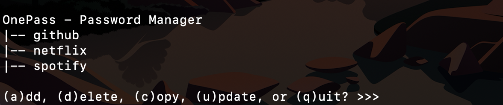

# OnePass - Password Manager
OnePass is a simple and easy-to-use python script. With OnePass, all passwords are stored locally on your system in an SQLite database. Passwords can be easily managed from the terminal or command line. Your password database or "keychain" can also be easily copied from one local system to another.

## How to Use
You will need Python 3 and the pyperclip module installed on your system. 

You can clone this repository into a new directory on your local system. From there, I would recommend creating a virtual environment in that directory. 

The version of pyperclip used for OnePass is stored in the requirements.txt file of this repository. Once your virtual environment is created and you have it activated, you can run the below command in your terminal to install the correct version (but any version will most likely work).

pip install -r requirements.txt

If you are new to virtual environments, I would highly recommend the below two videos by Corey Schafer (all of his python videos on youtube are superb).

https://www.youtube.com/watch?v=Kg1Yvry_Ydk (Mac & Linux)\
https://www.youtube.com/watch?v=APOPm01BVrk (Windows)

## Security and Acknowledgments
Please note that OnePass does not have any built-in security. I would not recommend using it unless you trust the security of your local computer and/or have your own means of security in place.

This project was built primarily for educational purposes. As such, my focus was on learning how to use python in conjunction with a database and not database security. However, it is something I would like to swing back to and add in the future. If you have any ideas, feel free to fork and open a Pull Request.

With OnePass, I tried to mimic some of the functionality of pass (https://www.passwordstore.org/). If you are on a UNIX system, I would highly recommend it! It's what I have been using as my daily password manager and I think the simplicity and security are fantastic.

